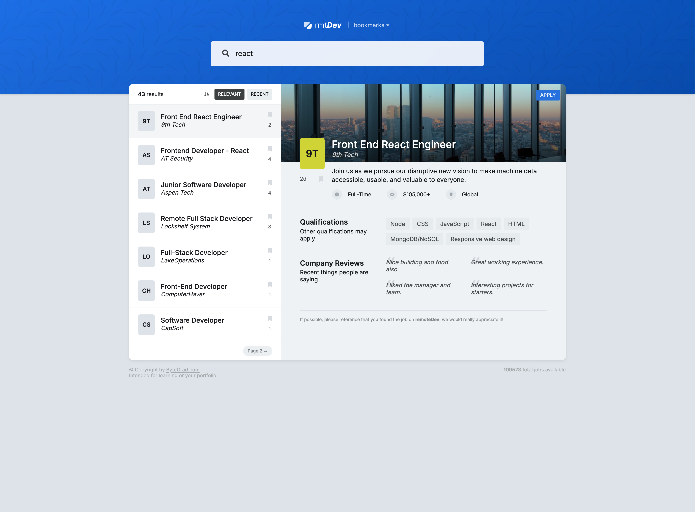

# 🔍 Job Search App

A modern, fast, and responsive job search UI built with **React + TypeScript** using **context providers**, **custom hooks**, and **component composition**.

---

## 📸 Screenshot



## ✨ Features

- 🔎 Search jobs and view detailed listings  
- 📄 Paginated & sorted job listings  
- 🔖 Bookmark your favorite jobs  
- 📊 Sort by relevance or date posted  
- ⚡ Fully typed with TypeScript  
- 🧠 Built with React Context and custom hooks  
- 🎨 Clean, accessible and responsive design  
- ☁️ Hot-toast notifications and modern UI  

---

## 🧱 Project Structure

```
.
├── components               # Reusable and styled React components
├── contexts                # Global state providers (Context API)
├── lib                     # Constants, types, hooks, utilities
├── index.css               # Global styles
├── main.tsx                # React entry point
└── vite-env.d.ts           # Vite environment declarations
```

---

## 🚀 Getting Started

### 1. Clone the repository

```bash
git clone https://github.com/aminetiouk/remoteDev
cd remoteDev
```

### 2. Install dependencies

```bash
npm install
```

### 3. Run locally

```bash
npm run dev
```

The app should be running at [http://localhost:5173](http://localhost:5173)

---

## 🧪 Technologies Used

- [React](https://reactjs.org/)
- [TypeScript](https://www.typescriptlang.org/)
- [Vite](https://vitejs.dev/)
- [React Hot Toast](https://react-hot-toast.com/)
- [CSS Modules](https://github.com/css-modules/css-modules) (or plain CSS)
- Context API & Custom Hooks

---

## 🧹 Scripts

| Command             | Description              |
|---------------------|--------------------------|
| `npm run dev`       | Start development server |
| `npm run build`     | Build for production     |
| `npm run preview`   | Preview production build |

---

## 📝 License

This project is licensed under the MIT License.

---

## 🙌 Acknowledgments

Built with ❤️ using modern React patterns and best practices.
